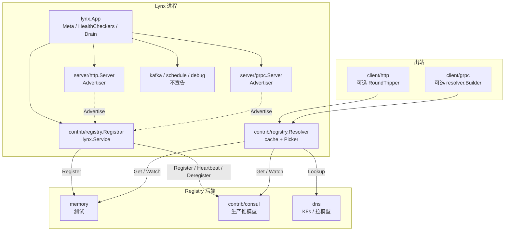
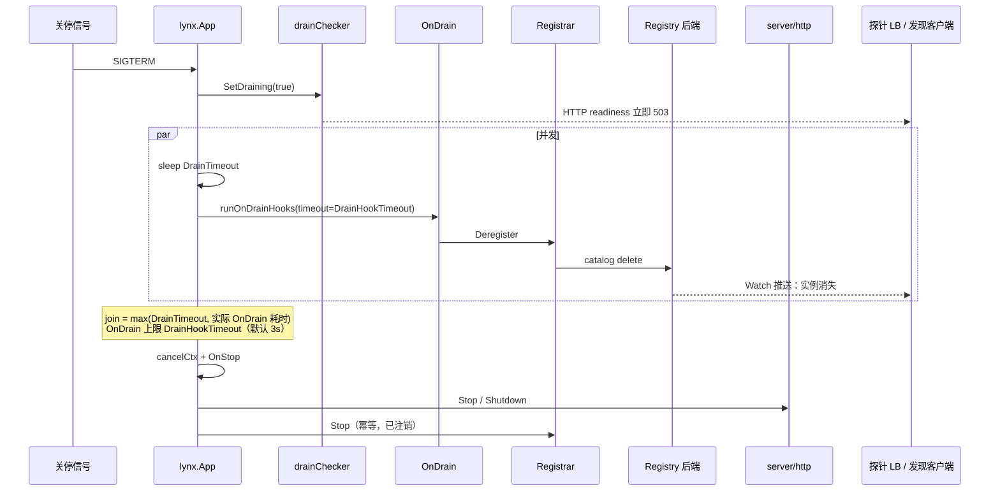

# Lynx 服务注册与发现设计

| 字段 | 内容 |
| --- | --- |
| 标题 | Lynx Service Registry & Discovery |
| 作者 | TBD |
| 日期 | 2026-08-15 |
| 状态 | Draft |
| 适用版本 | v1.1+（v1.0 API 冻结后的增量能力） |
| 相关路线图 | `ROADMAP.md` Phase E3「定位选择」 |

---

## Overview

Lynx 当前把进程生命周期、健康检查和关停排水（`DrainTimeout`）做得很好，但**没有**服务注册/发现：HTTP/gRPC 客户端只接受静态 URL / `Dial(target)`（见 `client/http`、`client/grpc`），实例之间靠调用方手写地址或依赖集群外的 DNS/Service。`ROADMAP.md` E3 明确把服务发现标为「按需评估，默认不做」，并给出边界：**K8s 环境以 DNS/Service 为主，必要时以 contrib 提供**。

本设计在不破坏「核心精简、可选零成本」原则的前提下，增加一套 **薄接口 + 可插拔后端** 的注册/发现能力：

- **注册（Registry）**：进程在监听就绪后把实例写入注册中心；关停排水一开始即注销，避免注册中心客户端在排水窗口内继续打过来。
- **发现（Discovery）**：客户端按 `service.name` 拉取或 Watch 健康实例，带进程内缓存；负载均衡只提供 Picker 钩子，不自研完整 client-side LB。
- **落点**：接口、内存后端、Registrar 服务、Resolver 放在 `contrib/registry`；首个生产后端为 Consul（独立模块 `contrib/consul`）；DNS 作为 K8s 友好的只读发现后端内置于 `contrib/registry`（无第三方依赖）。不用的应用不 import、不 Register，零成本。

`lynx.go` 关停路径的注释已经预留了这一能力：

```513:516:D:\Codes\lynx-go\lynx\lynx.go
	// 关闭 actor：收到退出信号或应用上下文被取消时，先在 actor 内执行
	// OnStop hooks，返回后 run.Group 才按注册顺序停止服务——保证清理逻辑
	//（如从服务发现注销）发生在服务仍在服务期间。OnStop 错误随 Run() 上抛，
	// 让调用方（如 K8s）感知关停失败。
```

现有 `OnStop` 发生在 **DrainTimeout 睡眠之后**，对探针型 LB 足够，对注册中心客户端偏晚。本设计用一次向后兼容的核心增量（导出 `ErrDraining` + `App.OnDrain`，带独立超时、与排水睡眠并发）把注销点对齐到排水开始。客户端 URI scheme 定为 `registry`（见 D14），避免占用未来其它 `lynx://` 资源。

---

## Background & Motivation

### 当前状态

| 能力 | 现状 | 文件 |
| --- | --- | --- |
| 应用身份 | `lynx.Meta(ctx)` → `{Name, ID, Version}`，键为 `service.name` / `service.id` / `service.version`（v1.0 已删除顶层回退） | `lynx.go` `init()` |
| 监听地址 | HTTP 默认 `:8080`，gRPC 默认 `:9090`，均在 `Start` 内 `net.Listen`。gRPC 已把 `listener` 存进未导出字段，但**没有** `Addr()`；HTTP **不保存** listener，也没有 `Addr()` | `server/http/server.go`、`server/grpc/server.go` |
| 实际地址先例 | `debug.Service.Addr()` 在 `Start` 后返回 `listener.Addr()`，支持 `:0` | `debug/debug.go` |
| 健康检查 | `lynx.Checker`；HTTP `/healthz/liveness`（不消费检查器）与 `/healthz/readiness`；gRPC `grpc.health.v1` | `health.go`、`server/http`、`server/grpc` |
| 关停排水 | `WithDrainTimeout`：置位内部 `drainChecker` → readiness 立即 503 → 睡眠 → `cancelCtx` → `OnStop` → 各服务 `Stop` | `drain.go`、`lynx.go` `Run()` |
| 出站调用 | `client/http` 吃绝对 URL；`client/grpc.Dial(target)` 吃静态 target；无 resolver | `client/http/client.go`、`client/grpc/client.go` |
| 多实例 | `ServiceFactory` 按 `FactoryOptions.Instances` 展开，典型用途是 Kafka 消费组，不是对外服务 | `service.go`、`lynx.go` `addServiceFactories` |
| 可选服务先例 | `kafka.NewFromConfig` 段缺失返回 `(nil, nil)`，调用方不得 `Register` | `contrib/kafka/fromconfig.go` |
| 路线图立场 | 「K8s 以 DNS/Service 为主，必要时 contrib」 | `ROADMAP.md` E3 |

今天一个 Lynx 进程要被别的进程找到，只有三条路：

1. **写死地址**（示例与文档的默认路径，见 `docs/06-clients.md` 的 `http://user-service/users/1`——这其实已经在假装有 DNS）。
2. **集群 DNS / K8s Service**（ROADMAP 推荐的主路径，框架零介入）。
3. **服务网格 sidecar**（Istio / Consul Connect / Linkerd）：注册、摘流、mTLS 都在网格，Lynx 只需要把 readiness 做好。

第 2、3 条在许多生产环境已经够用。需要进程内注册/发现的场景是：

- 非 K8s（裸机、VM、传统机房）且没有网格；
- 需要按 **version / tag / weight / 协议** 做比 DNS 更细的路由；
- 同一进程同时暴露 HTTP + gRPC，希望一条实例记录挂多个 Endpoint；
- 本地/集成测试需要可注入的假注册表。

### 痛点

1. **关停时序与发现不同步**。排水只让探针型 LB 摘流；注册中心的 Watch 客户端在整个 `DrainTimeout` 窗口内仍会解析到本实例。`OnStop` 注释设想的「仍在服务期间注销」发生在排水结束之后，对发现客户端偏晚。
2. **地址不可观测**。HTTP `Start` 不保存 `net.Listener`；gRPC 保存了未导出的 `listener` 但没有 `Addr()`。`:0` 与「监听 `:8080`、对外宣告 `10.1.2.3:8080`」无法一等表达。`debug.Service.Addr()` 已经有正确先例。
3. **客户端是静态的**。`client/http` / `client/grpc` 在 v1.1.0 落地且语义已按该版本约定；接入发现必须是 **钩子** 而不是改客户端核心语义。
4. **核心必须继续轻**。Consul/etcd/Nacos 客户端都不能进根 `go.mod`。根模块现有依赖已经收敛到 pflag/viper/otel/grpc。

---

## Goals & Non-Goals

### Goals

1. 提供可插拔的 `Registry`（写）与 `Discovery`（读）接口；内存后端可单测；至少一个生产后端（Consul）。
2. 注册走 Lynx `Service`/`Lifecycle`：`Start` 成功后注册，排水开始即注销，`Stop` 幂等补注销。
3. 实例模型覆盖：`name` / `id` / `version` / 多 Endpoint（协议+地址）/ 健康状态 / tags / meta / weight。
4. 客户端：Watch 优先、Poll 回退、进程内缓存；`Picker` 钩子（random / round-robin，v1 **不读 Weight**）；gRPC 走标准 `resolver.Builder`（scheme `registry`），HTTP 走 `http.RoundTripper`。
5. 与现有 `DrainTimeout` / `HealthCheckers` / readiness **三通道对齐**：心跳、readiness、liveness 受众不同；默认 `affect_readiness: true` 让心跳连续失败进入 readiness 聚合（可选关闭）。注销发生在排水置位之时。
6. 配置驱动，键风格对齐 `service.*` 与 `kafka.NewFromConfig` 的「段缺失即关闭」。
7. 完全可选：不 import `contrib/registry` 的应用二进制与依赖图零变化。
8. HTTP 与 gRPC 均可宣告；同一进程一条 Instance、多个 Endpoint。
9. 与 `ServiceFactory` 的关系写清楚：默认 **一进程一 Instance**，工厂展开的 worker 不自动注册。
10. CLI / `lynx.Command` 进程**按约定不调用 `Bind`**，避免短命令污染目录。这不是库级配置开关。

### Non-Goals（本设计明确不做）

- 不把注册中心客户端塞进根模块，不增加核心必选依赖。
- 不实现完整服务网格（mTLS、L7 策略、故障注入）。网格场景继续只用 readiness + DNS。
- 不实现全集群控制面、配置中心（Nacos config / Apollo）。配置中心仍按 ROADMAP E3 另案评估。
- 不把 Kafka consumer / schedule Task / debug pprof 登记为可发现服务。
- 不自研加权最小连接等复杂 LB；gRPC 复用官方 `round_robin` / `pick_first`。
- 不做跨机房自动故障转移、服务依赖图、自动订阅全部服务。
- 不在 v1 实现 Nacos / etcd / K8s EndpointSlice 后端（接口预留，后续独立 PR）。
- 不把心跳失败自动写成 `/healthz/liveness` 失败（避免注册中心抖动杀进程）。

---

## Key Decisions

| # | 决策 | 选择 | 理由 |
| --- | --- | --- | --- |
| D1 | 模块切分 | **薄核心增量 + `contrib/registry` 门面 + `contrib/consul` 后端** | 对齐 pubsub/kafka：接口与零依赖实现放轻模块，重客户端独立 `go.mod`。不用的应用零成本。 |
| D2 | 首个生产后端 | **Consul**（DNS 作为内置只读后端） | 服务目录 + TTL/HTTP/gRPC check + blocking query 与本模型 1:1；官方 Go client 成熟；kratos/go-kit/kitex 均 Consul 优先。K8s 主路径用 DNS，不必先做 EndpointSlice。Nacos 作 CN 生态第二后端，不进 v1。 |
| D3 | 推 vs 拉 | **推（注册+心跳）与拉（DNS）并存，同一套 Discovery 接口** | 非 K8s 需要推；K8s/网格需要拉。`backend: dns` 只返回 Discovery，**不** Bind Registrar。 |
| D4 | 进程 vs 网格 | **进程内库，网格是外部替代而非依赖** | Lynx 定位轻框架。Istio/Connect 用户不启用本模块即可。 |
| D5 | 注册粒度 | **一进程一条 Instance，挂多 Endpoint** | 与 `lynx.Metadata` 对齐。`ServiceFactory` 用于 Kafka worker，不是对外身份。 |
| D6 | 注销时机 | **排水置位后立即跑 `OnDrain`，与 `DrainTimeout` 睡眠并发**；独立 `DrainHookTimeout`（默认 3s）；`Stop` 幂等补刀 | `OnStop` 在 DrainTimeout 之后，对发现客户端偏晚。同步无超时的 `OnDrain` 会挂死关停 actor。并发 + 超时既立刻开始注销，又不在已有排水窗口上再叠一段（有钩子时上界变为 `max(DrainTimeout, DrainHookTimeout) + …`）。 |
| D7 | 健康模型 | **三通道，可选耦合**：心跳 / readiness / liveness 受众不同；默认 `affect_readiness: true` | 心跳失败默认进入 readiness 聚合（探针 LB 摘流），**从不**进入 liveness。设 `false` 可在注册中心抖动时保住探针就绪。 |
| D8 | 核心 API 增量 | 导出 `ErrDraining`；`App.OnDrain` + `WithDrainHookTimeout`；HTTP/gRPC `Addr()` / `WithAdvertiseAddr` | 用户代码源码兼容。打破的只有 `App` 测试 fake（`boot/bootstrap_test.go`）。`contrib/registry` 的 `go.mod` **require** 带这些符号的根版本。不把 Registry 类型放进根包。 |
| D9 | 注册就绪条件 | **配置 / `LYNX_ADVERTISE_HOST` 显式宣告** + 注册中心 health check；`:0` 走 `Advertiser` | `OnStart` 早于 `Service.Start`。**禁止**在容器里猜第一块 NIC：host 空且 env 空则 `Init` 失败（endpoints 已是 `host:port` 时可跳过）。 |
| D10 | 客户端 LB | **Picker 钩子 + gRPC 标准 resolver**，不改 `client/http`/`client/grpc` 核心 | v1.1 客户端语义已约定。发现是 opt-in Transport / `grpc.WithResolvers`。v1 Picker **忽略 Weight**。 |
| D11 | 注册失败策略 | **启动默认 fail-fast**（`Start` 返回 error，应用退出）。`fail_fast: false`：**`Start` 仍必须阻塞到 Stop**；首次 Register 失败只启动后台重试，`CheckHealth` 在成功前为 `ErrNotRegistered` | `oklog/run` 里 `Start` 返回任意值（含 nil）都会拆掉整个 group（`lynx.go` 427–429、564）。重试循环停在内部 `stopping` 旗标上，不得把「等 Start ctx」当退出条件（该 ctx 在 `Stop` 之后才取消）。 |
| D12 | 默认 TTL | 心跳 **10s**，TTL **30s**，critical 后注销 **60s**；Resolver stale 上限 **2×TTL（60s）** | 3 次心跳窗口；与 gRPC `DefaultHealthCheckPeriod=10s` 同量级。分区 Watch 不得无限提供死实例。 |
| D13 | Command / CLI | **用法约定，不是配置键**：长期服务 `Bind`；CLI/`app.Command` 的 setup **不要** `Bind` | `App` 无法查询「即将跑 Command」（`Command()` 只是再 `Register` 一个名为 `"command"` 的服务）。库级 `registry.command: false` 会连服务器也注册不上。短命令写目录只有 TTL 残渣。 |
| D14 | URI scheme | **`registry`**（`registry://<svc>/…` / `registry:///<svc>`） | 不用 `lynx`：避免与未来其它 lynx 资源争用；scheme 一经 tag 再改是 breaking。 |
| D15 | 后端装配 | **`contrib/registry.NewBackendFromConfig` 只构造 `memory` / `dns`**。Consul 由应用调用 `consul.NewFromConfig`（`contrib/consul` → `contrib/registry`，与 kafka→pubsub 同方向） | 门面模块依赖「根 lynx + 标准库」。若它 import consul 会形成模块环。`backend: consul` 时工厂返回明确错误。`Bind(app, nil)` 是 no-op。 |

---

## Proposed Design

### 架构总览



门面/后端切分刻意模仿 `contrib/pubsub.Transport` + `contrib/kafka`：

- `contrib/registry`：类型、接口、Registrar、Resolver、Picker、memory、dns、`NewBackendFromConfig`（**仅** memory/dns）。依赖只有根 `lynx` + 标准库，**不** import `contrib/consul`。
- `contrib/consul`：实现 `registry.Registry` 与 `registry.Discovery`，`replace => ../../`，独立 tag `contrib/consul/vX.Y.Z`。

### 包布局

```
contrib/registry/                  # module github.com/lynx-go/lynx/contrib/registry
  registry.go                      # Instance / Endpoint / Status / Registry / Discovery / Watcher
  advertiser.go                    # Advertiser / EndpointSource
  registrar.go                     # lynx.Service：注册、心跳、注销
  resolver.go                      # 进程内缓存 + Watch/Poll
  picker.go                        # Random / RoundRobin / Picker 接口
  memory.go                        # 进程内 Registry+Discovery（测试）
  dns.go                           # 只读 Discovery（net.Resolver）
  fromconfig.go                    # NewBackendFromConfig (memory/dns only) / NewFromConfig / Bind
  http_transport.go                # 可选 http.RoundTripper
  grpc_resolver.go                 # 可选 grpc resolver.Builder
  errors.go
  *_test.go

contrib/consul/                    # module github.com/lynx-go/lynx/contrib/consul
  consul.go                        # Registry + Discovery
  fromconfig.go
  consul_test.go                   # httptest 假 Consul；集成测试 build tag
  LICENSE
  go.mod                           # require hashicorp/consul/api
```

`go.work` 增加 `./contrib/registry`、`./contrib/consul`。`Taskfile.yml` `release-all` 增加对应 tag。

不把类型放进根包 `lynx`：根包继续只有 `Service` / `Checker` / `Config`。发现是可选能力，不是生命周期原语。

### 数据模型

```go
package registry

// Protocol 是 Endpoint 的应用层协议。未知值按 opaque 处理，不拒绝。
const (
    ProtocolHTTP  = "http"
    ProtocolHTTPS = "https"
    ProtocolGRPC  = "grpc"
)

type Status int

const (
    StatusUnknown Status = iota
    StatusPassing
    StatusWarning
    StatusCritical
    // v1 不定义 StatusDraining：排水时直接 Deregister（目录删除），
    // 客户端不会看到「正在排水」的中间态。若以后要先改状态再删，另开 PR。
)

// Endpoint 是一条可拨号地址。Address 必须是 host:port（禁止裸 ":8080"）。
type Endpoint struct {
    Protocol string `json:"protocol"` // http / https / grpc
    Address  string `json:"address"`  // 192.168.1.10:8080
}

// Instance 是一条目录记录：一进程一条，可挂多个 Endpoint。
type Instance struct {
    Name      string            `json:"name"`       // = lynx.Meta.Name = service.name
    ID        string            `json:"id"`         // = lynx.Meta.ID，集群内唯一
    Version   string            `json:"version"`    // = lynx.Meta.Version
    Endpoints []Endpoint        `json:"endpoints"`
    Status    Status            `json:"status"`
    Tags      []string          `json:"tags"`
    Meta      map[string]string `json:"meta"`
    Weight    int               `json:"weight"` // 缺省 100；v1 内置 Picker 忽略此字段
}

// Filter 是 Get/Watch 的可选过滤。零值即安全默认（只返回 Passing）。
type Filter struct {
    Protocol          string   // 只保留含该协议 Endpoint 的实例；空 = 不过滤协议
    Tags              []string // 必须同时具备；空 = 不过滤
    IncludeUnhealthy  bool     // 零值 false：丢掉非 StatusPassing。不用 Passing bool，避免零值踩坑
}
```

身份映射固定为：

| Instance 字段 | 来源（优先级从高到低） |
| --- | --- |
| `Name` | `registry.service_name` → `lynx.Meta(ctx).Name` → `service.name` |
| `ID` | `registry.instance_id` → `lynx.Meta(ctx).ID`（默认 hostname） |
| `Version` | `lynx.Meta(ctx).Version` |
| `Endpoints` | `registry.endpoints` + 各 `Advertiser`；host 由 `registry.advertise.host` 补全 |
| `Tags` / `Meta` / `Weight` | `registry.tags` / `registry.meta` / `registry.weight` |
| 自动 Meta | `lynx_version`（框架版本，可选）、`protocol` 列表 |

`ID` 必须在注册中心命名空间内唯一。多副本部署必须通过 Downward API（推荐 `metadata.name`，或 `spec.nodeName`+pod）/ 显式 `service.id` 区分；框架**不**自动追加 UUID（避免每次重启换 ID 导致旧 TTL 记录残留）。

同 ID 二次注册是 **last-write-wins upsert**（Consul `ServiceID` 覆盖），**没有 fencing token / ModifyIndex 栅栏**。两个误配副本会互相覆盖目录，客户端看到地址在两者间抖动，直到其中一个 TTL 过期。这是运维问题，不是框架能静默修的。

`Name` 校验由 Registrar `Init` 执行，规则**严于**核心 `Options.Validate`（后者只检查长度 ≤63，见 `options.go`）：长度 1–63，字符集 `[a-zA-Z0-9]([a-zA-Z0-9-]*[a-zA-Z0-9])?`（单段 DNS 标签）。非法则 `Init` 失败。不要声称与 `Options.Name` 同一规则。

### 接口

```go
package registry

import "context"

// Registry 是写接口。实现必须并发安全。Deregister / Close 必须幂等。
type Registry interface {
    Register(ctx context.Context, inst Instance) error
    Deregister(ctx context.Context, serviceName, instanceID string) error
    // Heartbeat 刷新 TTL。后端若只用 HTTP/gRPC 被动探针，可返回 nil。
    Heartbeat(ctx context.Context, serviceName, instanceID string) error
    Close() error
}

// Discovery 是读接口。Get 必须返回快照副本，调用方可原地改。
type Discovery interface {
    GetService(ctx context.Context, name string, filter Filter) ([]Instance, error)
    Watch(ctx context.Context, name string, filter Filter) (Watcher, error)
}

// Watcher.Next 阻塞至集合变化、ctx 取消或不可恢复错误。
// 实现应在首次调用 Next 时立即推送当前快照（含空列表）。
type Watcher interface {
    Next() ([]Instance, error)
    Stop() error
}

// Advertiser 由对外监听的服务实现。Start 前 Endpoints 可返回 nil。
// Registrar 在注册前最多等待 advertise_timeout 直到至少一条 Endpoint。
type Advertiser interface {
    Endpoints() []Endpoint
}
```

`Registry` 与 `Discovery` 刻意拆开：DNS 后端只实现 `Discovery`。`contrib/consul` 一个类型同时实现两者。

配置驱动的装配：**轻模块只建零依赖后端；Consul 在应用侧构造**，避免 `contrib/registry` → `contrib/consul` → `contrib/registry` 环（与 `contrib/kafka` 依赖 `contrib/pubsub`、反向禁止相同）。

```go
// contrib/registry：只认识 memory / dns。
// 段缺失 / enabled:false / backend:"" → (nil, nil, nil)。
// backend=dns → (nil, Discovery, nil)。
// backend=consul → error：请使用 consul.NewFromConfig。
// 未知 backend → error。
func NewBackendFromConfig(cfg lynx.Config) (Registry, Discovery, error)

// contrib/consul：读 registry.consul；registry 关闭或缺失 → (nil, nil)。
// *Client 同时实现 Registry 与 Discovery。
func NewFromConfig(cfg lynx.Config) (*Client, error)

// 测试或显式构造：
mem := registry.NewMemory()
reg := registry.NewRegistrar(mem, registry.WithAdvertisers(httpAdv, grpcAdv))
```

应用 setup（或 Wire provider）按 `registry.backend` 分支，见「使用示例」。`registry.NewFromConfig(cfg, nil, …)` 在需要写目录的 backend（memory/consul）时返回 `backend requires a Registry`。

`Bind(app, nil)` 与 `Bind(app, (*Registrar)(nil))` 均为 **no-op**。

### Registrar：生命周期服务

`Registrar` 实现 `lynx.Service` 与 `lynx.Checker`。

```go
type Registrar struct { /* ... */ }

func NewRegistrar(r Registry, opts ...RegistrarOption) *Registrar
func NewFromConfig(cfg lynx.Config, r Registry, advertisers ...Advertiser) (*Registrar, error)
// Bind 是推荐入口：Register 服务 + 挂 OnDrain 注销钩子。
// r == nil 时 no-op。通过 type-assert interface{ OnDrain(...) } 调用，
// 以便测试 fake 未实现新方法时仍能编译；生产 go.mod 仍 require 含 OnDrain 的根版本。
func Bind(app lynx.App, r *Registrar)

func (r *Registrar) Name() string            // "registry"
func (r *Registrar) Init(ctx lynx.AppContext) error
func (r *Registrar) Start(ctx context.Context) error
func (r *Registrar) Stop(ctx context.Context) error
func (r *Registrar) CheckHealth() error
func (r *Registrar) DeregisterHook() lynx.HookFunc
```

`NewFromConfig` 约定对齐 `kafka.NewFromConfig`：

- `registry` 段缺失、`registry.enabled: false`、或 `backend: ""` → 返回 `(nil, nil)`，**调用方不得 Register**（`Bind` 已对 nil 做 no-op）。
- `backend: dns` → 返回 `(nil, nil)`（DNS 只读，不要 Registrar）。调用方只用 Discovery 建 Resolver。
- 需要写目录（memory/consul）且 `r == nil` → error。
- 段存在但字段类型非法 → 返回 error，由 `Run()` 暴露。
- **没有** `registry.command` 键。`NewFromConfig` / `Bind` 不根据「是不是 CLI」决定是否注册。长期服务 setup 调用 `Bind`；`app.Command` / 一次性 CLI 的 setup **不要**调用 `Bind`。`App` 没有「将跑 Command」的探测 API。

`Init`（只读 `AppContext`，不注册钩子——这是 `docs/03-core-concepts.md` 3.6 的硬边界）：

1. 从 `lynx.Meta(ctx.Context())` 填 Name/ID/Version；按上文 DNS 标签规则校验 `Name`。
2. 解析 advertise host，顺序：**仅** `registry.advertise.host` → `os.Getenv("LYNX_ADVERTISE_HOST")`（**直接读环境，不经过 Viper**）。两者皆空时：若所有 Endpoint 已经是 `host:port` 则跳过；否则 `Init` 失败。**不做**「第一块非回环 IPv4 / hostname」猜测——Docker/K8s 里经常拿到错误 NIC。
3. 把配置里裸 `:port` 补成 `host:port`，**必须**用 `net.JoinHostPort(host, port)`（IPv6 的 `2001:db8::1` + `8080` → `[2001:db8::1]:8080`）。禁止字符串拼接 `host + ":" + port`。补全后仍无 host → `Init` 失败。单测覆盖 IPv6 advertise host（K8s `status.podIP` 在双栈集群可能是 IPv6）。
4. 取 `ctx.Logger("service", "registry")`。
5. 记下 `HealthCheckers` 函数，供同版本排水观察。

默认 `DefaultBindConfigFunc`（`lynx.go` 305–323）**不会** `AutomaticEnv` / `SetEnvPrefix` / `BindEnv`。除 `LYNX_ADVERTISE_HOST` 由 Registrar 直读外，其它 `LYNX_REGISTRY_*` 只有应用自己的 `BindConfigFunc` 写了绑定才会生效。`fromconfig.go` 的 GoDoc 给出可复制片段：

```go
c.SetEnvPrefix("LYNX")
c.AutomaticEnv()
_ = c.BindEnv("registry.enabled", "LYNX_REGISTRY_ENABLED")
_ = c.BindEnv("registry.backend", "LYNX_REGISTRY_BACKEND")
_ = c.BindEnv("registry.consul.address", "LYNX_REGISTRY_CONSUL_ADDRESS")
_ = c.BindEnv("registry.consul.token", "LYNX_REGISTRY_CONSUL_TOKEN")
// Consul 官方 CONSUL_HTTP_TOKEN 由 contrib/consul 在 New 时 os.Getenv 直读，
// 优先于配置文件（空 token 才回落配置）。
```

`Start`（与 HTTP/gRPC **并发**）。**除 `fail_fast: true` 且首次 Register 失败外，`Start` 不得返回**——`lynx.go` 427–429 / 564：`Start` 返回任意值（含 nil）都会让 `oklog/run` 拆掉整个 group，HTTP/gRPC 随之停止。对齐 `contrib/schedule`、`debug`：`Start` 阻塞到 Stop。

1. 若配置了 `Advertiser`，轮询 `Endpoints()` 直到非空或 `advertise_timeout`（默认 5s）。超时且没有静态 Endpoint → `Start` 返回 error。
2. 调用一次 `Register`（单次 RPC 超时 3s）。
   - `fail_fast: true`（默认）：失败则 **`Start` 返回非 nil error** → 应用退出。这是 `Start` 唯一的「提前返回」路径。
   - `fail_fast: false`：失败则 `CheckHealth` 保持 `ErrNotRegistered`，启动后台重试 goroutine（1s→2s→4s…上限 10s）。重试退出条件是内部 `stopping` 旗标（`Stop` 置位），**不是** `Start` 的 ctx——该 ctx 来自 `WithoutCancel(app.ctx)`，且框架在 `Stop` **之后**才 `cancel()`（`lynx.go` 405、435–436）。**禁止**写「`Start` 立刻返回 nil」。
3. 注册已成功则启动心跳 goroutine（间隔 10s，单次 RPC 超时 3s）。`fail_fast: false` 且仍在重试时，心跳在首次 Register 成功后再开。
4. 启动排水观察 goroutine（仅当 `drainChecker` 可能进入聚合，即 `DrainTimeout > 0`）。
5. **阻塞** `<-ctx.Done()`（或等价的「等 Stop」）。`fail_fast: false` 也走这一步。

`Stop`：

1. 停心跳、后台注册重试与观察循环。
2. 调 `Deregister`（超时 min(ctx deadline, 3s)）。已注销则 no-op。
3. 将内部状态标为已注销：此后 `CheckHealth` 返回 `ErrNotRegistered`（非 nil），readiness 保持不健康。
4. `Registry.Close()`。
5. 必须容忍 Stop-before-Start（`Lifecycle` 契约，见 `service.go` 注释）。

`CheckHealth` 状态机：

| 阶段 | 返回 |
| --- | --- |
| 尚未成功 Register（含 `fail_fast: false` 后台重试中） | error（`ErrNotRegistered`） |
| 已注册且心跳连续失败 < 3 次 | nil |
| 已注册且心跳连续失败 ≥ 3 次 | error（`ErrHeartbeatFailed`） |
| 已 Deregister / 已 Stop | error（`ErrNotRegistered`） |

`Registrar` **不是**对外服务。心跳连续失败 **不** 把 HTTP liveness 打成 503。默认 `affect_readiness: true` 时 Registrar 实现 `Checker` 并进入 `app.HealthCheckers()`，从而让 **readiness** 变红。设 `false` 时 **不** 实现/不注册为 Checker（构造时不满足 `Checker` 断言，或 `CheckHealth` 恒 nil 且不加入列表——实现选前者：一个不实现 `Checker` 的包装，避免误进聚合）。

`affect_readiness: true` 时，`command.go` 会在跑业务 fn 前重试等待全部 Checker（含 Registrar）。因此 CLI setup **不要** `Bind` Registrar，否则命令会空等注册中心或写下一条短命目录。这是文档约定，不是 `NewFromConfig` 里的开关。

### 与 Drain / 健康检查的时序

当前关停（`lynx.go` `Run()` / `docs/03-core-concepts.md` 3.7）：

```
信号 / 中断 / app.Close()
  ├─ drainChecker.SetDraining(true)     // readiness 立即失败
  ├─ sleep DrainTimeout                 // 服务仍在 Accept
  ├─ cancelCtx
  ├─ OnStop hooks                       // 今日注释所说的「注销点」——偏晚
  └─ 各服务 Stop（含 Registrar.Stop）
```

目标时序（**`OnDrain` 与排水睡眠并发**，不是串在睡眠前面）：



`runOnDrainHooks` 照抄 `runOnStopHooks`（`lynx.go` 588–624）：持锁拷贝切片；`context.WithTimeout(context.Background(), DrainHookTimeout)`——**禁止**把尚未取消、也没有 deadline 的 `app.ctx` 传给钩子；逐个钩子在该 ctx 下执行，超时记入 `ShutdownErrors` 并继续；钩子错误不打断排水。无钩子时整段跳过，不增加任何等待。

`Options.DrainHookTimeout`：默认 **3s**（与 Registrar `Deregister` 单次预算相同）；`EnsureDefaults` 在为 0 且存在挂钩需求时填 3s，实现上「无钩子则不启动定时器」。`WithDrainHookTimeout(d)`；负值 `Validate` 失败（对齐 `ErrDrainTimeoutInvalid`）。

关停时长上界（更新后的公式，必须写进 `docs/03` §3.7）：

| 情况 | 上界 |
| --- | --- |
| 无 `OnDrain` 钩子 | `DrainTimeout + ShutdownTimeout + Σ StopTimeout`（与今日相同） |
| 有钩子 | `max(DrainTimeout, DrainHookTimeout) + ShutdownTimeout + Σ StopTimeout` |

K8s `terminationGracePeriodSeconds` 必须覆盖**新公式**。注销从排水置位那一刻就开始，通常在 3s 内结束，不必再把一段超时串在 15–30s 排水前面（那会让「不增加上界」的旧表述在 `DrainTimeout=0` 时变成谎言）。`DrainTimeout=0` 且注册了钩子时，上界比今日多出最多 3s——这是有意的、写明的。

核心增量：

1. **导出 `ErrDraining`**（`drain.go` 现在是匿名 `errors.New("draining")`，`errors.Is` 匹配不了）。`CheckHealth` 改为 `return ErrDraining`。
2. **`App.OnDrain` + `WithDrainHookTimeout`**。`DrainTimeout=0` 时仍跑钩子（`SetDraining(true)` 今日就会执行，只是 checker 未进聚合）。
3. `boot.Bootstrap.WithDrainHooks`；**不**改 `boot.New` 签名。

**版本矩阵（不要把观察循环卖成「兼容未升级核心」）**：

| 组件 | 要求 |
| --- | --- |
| `contrib/registry` `go.mod` | `require github.com/lynx-go/lynx` ≥ 含 `OnDrain`/`ErrDraining` 的根 tag；`replace => ../../` 与 `contrib/kafka/go.mod` 相同 |
| `Bind` | `app.Register(r)` + type-assert `interface{ OnDrain(fns ...lynx.HookFunc) }`。老测试 fake 没有该方法时只 Register，不挂钩 |
| `watchDrain` | **同一版本**的安全网：用户忘了 `Bind`、只 `Register(reg)`，且 `DrainTimeout > 0`（`drainChecker` 在 `HealthCheckers` 里）时，50ms 轮询 `errors.Is(..., lynx.ErrDraining)` 后注销 |
| `DrainTimeout=0` | `drainChecker` **不**进聚合（`lynx.go` 645–651 红线）。此时没有 `ErrDraining` 可见，只能靠 `OnDrain` 或 `Stop` |

`watchDrain` **不能**让新 contrib 编过旧根模块：它依赖已导出的 `ErrDraining`。PR1 的回归测试必须锁住：导出该变量 **不得**在 `DrainTimeout=0` 时把 checker 塞进列表。

HTTP vs gRPC 探针可见性（排水摘流对注册中心 check 的真实延迟）：

| 检查方式 | 排水后何时变红 | v1 要求 |
| --- | --- | --- |
| Consul `http` → `/healthz/readiness` | **立即**（`handleReadiness` 每次请求都读 checkers） | **有 HTTP 端口时的推荐 check** |
| Consul `grpc` → `grpc.health.v1` | 最多一个 `HealthCheckPeriod`（**默认 10s**，`server/grpc` `startHealthPoller`） | **禁止**作为 gRPC-only 进程的唯一摘流手段 |
| Consul `ttl` + `OnDrain` Deregister | 主动 delete，Watch 立即推空 | **gRPC-only 进程必选**（TTL check + 排水注销） |

「排水开始 → Consul 也 critical」**只对 HTTP check 成立**。gRPC-only + `health_check.type: grpc` + 缓慢/失败的 Deregister，会让发现客户端在几乎整个排水窗口内仍打到本实例——这正是本设计要消灭的问题。失败模式表单独列这一行。gRPC poller 在排水边沿立即 `updateHealthStatus` 列为后续（v1 不做）。

心跳、`drainChecker`、kafka/schedule `CheckHealth` 仍是三个独立 Checker。HTTP readiness 聚合它们（已有行为）。

### 宣告地址与 Advertiser

问题：HTTP/gRPC 在 `Start` 里才 `net.Listen`，而所有 `Start` 并发；`OnStart` 又早于 `Start`（`lynx.go` `Run`：先 `runOnStartHooks`，再 `runG.Run`）。因此 **不能在 OnStart 里注册**。

v1 策略（改动面小）：

1. 配置静态 `registry.endpoints`（生产推荐，K8s 用 Downward API 填 host）。
2. 服务器实现可选 `Advertiser`。Registrar 等最多 5s。
3. HTTP/gRPC 增加与 `debug.Service.Addr()` 同语义的方法，以及宣告覆盖：

```go
// server/http、server/grpc —— 不 import contrib/registry
func (s *Server) Addr() string                 // Start 前 ""；之后为 ln.Addr()
func WithAdvertiseAddr(hostPort string) Option // 仅存字符串
func (s *Server) AdvertiseAddr() string
```

`Advertiser` 定义在 contrib。采用访问器 + 薄适配，**协议由调用方显式传入**，适配器**不得**读取未导出的 `o.TLSConfig` 来猜 `https`：

```go
// contrib/registry/advertiser.go
func HTTP(s *lynxhttp.Server, protocol string) Advertiser // protocol 必填：http 或 https
func GRPC(s *lynxgrpc.Server) Advertiser                  // 固定 protocol=grpc
func Static(protocol, hostPort string) Advertiser
```

`HTTP(s, "")` 视为 `http`，绝不因 TLS 自动升级。`:0` 在 Listen 成功后 `Addr()` 变为实际地址，Registrar 等到非空再注册。

**不把 Listen 前移到 Init**（曾考虑）。那能让 OnStart 注册，但改变 HTTP/gRPC 的失败模式（Init 失败 vs Start 失败），且 `Stop-before-Start` 要关已经 Listen 的 fd。收益不足以在 v1 动服务器生命周期。

`debug` 默认 `127.0.0.1:6060`，**禁止**被默认 Advertiser 扫进去。Registrar 只宣告显式传入的 Advertiser + 配置 endpoints。

Advertise host 解析（**不探测 NIC**）：

| 顺序 | 来源 |
| --- | --- |
| 1 | `registry.advertise.host` |
| 2 | `os.Getenv("LYNX_ADVERTISE_HOST")`（直读，不经 Viper） |
| 3 | 所有 Endpoint 已是完整 `host:port` → 无需 host |
| 失败 | `Init` 返回 error（例如「advertise host required」） |

裸 `:port` 与 host 组合一律 `net.JoinHostPort`。IPv6 单测：`LYNX_ADVERTISE_HOST=2001:db8::1` + `:8080` → `[2001:db8::1]:8080`。

K8s 推荐：

```yaml
env:
  - name: LYNX_ADVERTISE_HOST
    valueFrom:
      fieldRef:
        fieldPath: status.podIP
```

### 客户端发现

```go
type Picker interface {
    Pick(instances []Instance) (Instance, error)
}

func RandomPicker() Picker      // 均匀随机；忽略 Weight
func RoundRobinPicker() Picker  // 原子计数取模；忽略 Weight

var (
    ErrNoInstance = errors.New("registry: no healthy instance")
    ErrBadName    = errors.New("registry: empty or invalid service name")
)

type Resolver struct { /* cache, watchers */ }

func NewResolver(d Discovery, opts ...ResolverOption) *Resolver
// 默认：RoundRobinPicker、Filter.IncludeUnhealthy=false（只 Passing）、
// stale 上限 = 2 * heartbeat_ttl（缺省 60s）。
func (r *Resolver) Get(ctx context.Context, name string, filter Filter) (Instance, error)
func (r *Resolver) GetAll(ctx context.Context, name string, filter Filter) ([]Instance, error)
func (r *Resolver) Close() error

// EndpointOf 在已选 Instance 上按协议取地址：稳定顺序（切片下标）下
// 第一条 Protocol 匹配的 Endpoint。protocol 空则取 Endpoints[0]。
// 无匹配返回 ErrNoInstance。
func EndpointOf(inst Instance, protocol string) (Endpoint, error)
```

`GetAll`：后端返回空切片视为「当前无实例」，返回 `([], nil)`。Consul / 多数 DNS 无法区分「服务名不存在」与「零实例」，v1 **不**再引入 `ErrNotFound`。`Get` 在过滤后为空时返回 `ErrNoInstance`。空服务名返回 `ErrBadName`。

默认 Picker 是 **RoundRobin**，且 **忽略 `Instance.Weight`**（字段仍进入目录 / Consul Meta / `Weights.Passing`，供以后或外部消费者；Lynx v1 不读）。

**Endpoint 选择（Pick 之后）**：`EndpointOf(inst, filter.Protocol)`，稳定顺序 = `Instance.Endpoints` 登记顺序。同一协议多条（两个 HTTP 口）→ 取第一条。调用方要用第二个口，自己按 tag 拆成两条 Instance，或以后再加 `Filter.Tag` 选口。

缓存规则：

- `Watch` 成功：缓存由推送更新。收到空快照立即生效（服务下线），**不得**回退到旧非空列表。
- Watch 失败：指数退避重连（1s–30s），期间可提供最后一次成功快照（stale-while-revalidate），但 **年龄超过 `stale_max_age`（默认 `2 * heartbeat_ttl` = 60s）则丢弃**，`Get` 返回 `ErrNoInstance` 并打 warn。禁止分区后无限供应死实例。
- DNS：按 `discovery.poll_interval`（默认 15s）轮询；NXDOMAIN 负缓存遵循 DNS TTL，钳制在 [5s, 30s]。
- `Get` 在缓存未填充时同步 `GetService` 一次。
- Watch 默认 **consistent read**（Consul `QueryOptions.AllowStale=false`）。打开 `registry.consul.allow_stale` 才允许陈旧读。

#### URI 语法（scheme = `registry`，仅此一种）

**HTTP**（标准 URL，服务名在 Host）：

```
registry://<service-name>/<path>[?<query>]
registry://<service-name>/<path>?protocol=https
```

- Host = 服务名（`user-service`）。禁止把服务名放进 path。
- 默认 `Filter.Protocol=http`。查询参数 `protocol` 只能是 `http` 或 `https`；其它值 → RoundTrip 返回 error。
- **保留查询键**（v1 仅 `protocol`）：从 clone 的 `RawQuery` **删掉**后再交给后端，避免 `?protocol=https&id=1` 变成业务 URL 上的 `protocol=https`。
- 未指定 protocol 且没有任何 `http` Endpoint、但有 `https` → 回落到第一条 `https`（稳定顺序）。两者都有 → **只用 http**，避免明文/TLS 混选。
- 非 `registry` scheme **原样交给内层 Transport**（测试必须锁住）。

**gRPC**（gRPC target，服务名在 Endpoint path；**不**支持 `registry://user-service/grpc` 这种 authority 形式）：

```
registry:///<service-name>
registry:///<service-name>?protocol=grpc
```

解析：`url.Parse` 后 `Host` 必须为空，`Path` 去掉前导 `/` 即服务名。`Host` 非空 → Builder 返回 error（避免两种写法并存）。默认 protocol=`grpc`。

#### gRPC 接入（禁止把 `resolver.Register` 当唯一入口）

`resolver.Register` 是**进程全局**副作用，测试与多 resolver 进程会撞 scheme。支持且文档化的钩子是 **每条连接** 的 `grpc.WithResolvers`（`client/grpc.Dial` 已有 `WithDialOptions`）：

```go
// 必须吃 *Resolver，不得直接 Watch raw Discovery，
// 否则会绕过 stale_max_age / IncludeUnhealthy，与 HTTP 路径分叉。
b := registry.NewGRPCBuilder(rslv) // scheme() 返回 "registry"
conn, err := clientgrpc.Dial("registry:///user-service",
    clientgrpc.WithDialOptions(
        grpc.WithResolvers(b),
        grpc.WithDefaultServiceConfig(`{"loadBalancingConfig":[{"round_robin":{}}]}`),
    ),
)
```

`resolver.Register(b)` 仅作为可选便利写在文档里，并标明全局副作用。Builder 通过 Resolver 取实例（同一套空快照 / stale 上限 / 默认 Filter），再把每条 `Endpoint{Protocol:grpc}` 变成 `resolver.Address{Addr, Attributes}`（weight/version 进 Attributes，v1 官方 `round_robin` 不读）。**不**实现 `balancer.Balancer`。

#### HTTP 接入与重试契约

`client/http.WithClientOptions` 在 **otelhttp 包好默认 Transport 之后**执行（`client/http/client.go` `New`）。因此正确形状是包一层，而不是换掉 otel：

```go
cli := clienthttp.New(clienthttp.WithClientOptions(func(c *http.Client) {
    // c.Transport 此时已是 otelhttp.Transport
    c.Transport = registry.NewHTTPTransport(resolver).Wrap(c.Transport)
}))
resp, err := cli.Get(ctx, "registry://user-service/users/1")
```

`RoundTrip` **必须**：

1. 若 `req.URL.Scheme != "registry"`，原样 `base.RoundTrip(req)`。
2. **Clone** 请求（`req.Clone(req.Context())`），**禁止**改调用方的 `*http.Request` / `URL`。`client/http` 重试是 opt-in（默认 `New` 不重试），一旦 `WithRetry`，循环里每次 `c.client.Do(req)` 用的是**同一** `*http.Request`。若第一次把 `req.URL` 改成 `http://10.x:8080`，后续 502/503 会钉死在那台死实例上。Clone 之后每次 RoundTrip 重新 `Resolver.Get`。
3. 在 clone 上改写：`URL.Scheme` = 选中 Endpoint 的 protocol（`http`/`https`），`URL.Host` = `Endpoint.Address`，`Host` 头与 `URL.Host` 一致（除非调用方已设非空 Host，则保留）。`URL.Path` 保持。从 query 中 **删除保留键 `protocol`**，再写回 `RawQuery`。
4. 把 clone 交给 **内层** Transport（即 otelhttp），让 span 看到改写后的目标。

失败模式表不得再写「HTTP 已有 502/503 重试会换地址」：默认不重试；即便开了重试，也只有本 Transport 每次 clone+解析才能换实例。gRPC 换地址靠官方 `round_robin` 收到 resolver 更新，不是一次 RPC 内自动切。

**不修改** `client/http.Client.Do` 与 `client/grpc.Dial` 的默认构造函数。发现是 opt-in。

### ServiceFactory

`addServiceFactories` 只是循环 `New()` 再 `addServices`。Registrar 看的是 **应用身份**，不是「每个 lynx.Service 一条目录」。

| 场景 | 行为 |
| --- | --- |
| 一进程一个 HTTP + 一个 gRPC | 一条 Instance，两个 Endpoint |
| `ServiceFactory` 起 3 个 Kafka consumer | 不宣告 |
| 同进程两个 HTTP 端口（少见） | 两个 Advertiser，仍一条 Instance、两个 http Endpoint |
| 同主机多进程 | 靠不同 `service.id`（hostname 默认在容器里通常已唯一） |

不为工厂实例自动加 `-0`/`-1` 后缀。需要多身份时显式构造多个 `Registrar`（不推荐）。

### 配置

```yaml
service:
  name: user-service
  id: ""                 # 空 = hostname
  version: "1.2.0"

registry:
  enabled: true
  backend: consul        # memory | dns 由 registry.NewBackendFromConfig 构造
                         # consul 由应用调用 consul.NewFromConfig（见使用示例）
  fail_fast: true
  affect_readiness: true
  heartbeat_interval: 10s
  heartbeat_ttl: 30s
  deregister_after: 60s
  advertise_timeout: 5s
  tags: ["api", "internal"]
  meta:
    region: cn-east
    zone: az1
  weight: 100            # 写入目录；v1 Picker 忽略
  advertise:
    host: ""             # 空则读 LYNX_ADVERTISE_HOST；再空且 endpoint 无 host → Init 失败
  endpoints:
    - protocol: http
      address: ":8080"   # 用 advertise host 补全
    - protocol: grpc
      address: ":9090"
  health_check:
    type: http           # 有 HTTP 口时必须用 http（打 /healthz/readiness）
                         # gRPC-only：ttl（禁止只靠 grpc check）
    path: /healthz/readiness
    interval: 10s
    timeout: 3s
  discovery:
    watch: true
    poll_interval: 15s
    stale_max_age: 60s   # 默认 2*heartbeat_ttl；Watch 断开超过此时长丢弃 stale
  consul:
    address: 127.0.0.1:8500
    token: ""            # 空则 contrib/consul 直读 CONSUL_HTTP_TOKEN
    datacenter: ""
    namespace: ""
    allow_stale: false   # Watch/Get 默认 consistent
    tls:
      enabled: false
      ca_file: ""
      cert_file: ""
      key_file: ""
      insecure_skip_verify: false
  dns:
    domain: "svc.cluster.local"
    namespace: default   # {name}.{namespace}.{domain}
    ports:               # A/AAAA 无 SRV 时按协议补端口
      http: 8080
      https: 8443
      grpc: 9090
```

`registry.NewBackendFromConfig` / `registry.NewFromConfig` / `consul.NewFromConfig` 各自 `UnmarshalKey` 自己关心的子树。环境变量**不会**因默认 flags 自动生效。生效路径：

| 键 | 如何到达进程 |
| --- | --- |
| `registry.advertise.host` | 配置文件，或 Registrar `os.Getenv("LYNX_ADVERTISE_HOST")` |
| `registry.consul.token` | 配置文件，或 `contrib/consul` `os.Getenv("CONSUL_HTTP_TOKEN")` |
| 其它 `registry.*` | 仅当应用 `BindConfigFunc` 调用了上文片段中的 `BindEnv` |

不新增默认 CLI flag。发现是可选 contrib，不应出现在 `DefaultBindFlagsFunc`。

### Consul 后端要点

- 注册：`Agent.ServiceRegister`，`ServiceID=inst.ID`，`Name=inst.Name`，`Tags`，`Meta`（`version`、`weight`），`Port`/`Address` 取第一个匹配 check 协议的 Endpoint。同时写 Consul `Weights.Passing`（v1 Lynx Picker 不读）。
- **多 Endpoint 还原发生在 `contrib/consul` 内部**，不在通用 Resolver。其余 Endpoint 写入 Meta 键 **`lynx_endpoints`**，JSON schema（仅 consul 模块文档化）：

```json
[{"protocol":"grpc","address":"10.0.0.1:9090"}]
```

`GetService` / `Watch` 在返回 `[]Instance` 之前把该键解码回 `Instance.Endpoints`（主端口对应的 Endpoint 已在切片首位）。Resolver / memory / DNS **从不**解析这个键。memory 后端单测必须原生存两条 Endpoint，证明 Resolver 与 Consul 编码无关。

- Check：
  - `ttl`：`Heartbeat` → `Agent.UpdateTTL`；`DeregisterCriticalServiceAfter=60s`。gRPC-only **必须**用这个（加上 `OnDrain` Deregister）。
  - `http`：`http://{advertise}{path}`，推荐 `/healthz/readiness`。Heartbeat no-op。有 HTTP 口时的默认。
  - `grpc`：打 `grpc.health.v1`，摘流最多滞后 `HealthCheckPeriod`（10s）。**不得**作为唯一摘流手段。
- Watch：blocking `Health.Service(..., QueryOptions{WaitIndex, AllowStale: 配置值})`。默认 `AllowStale=false`。
- 排水写路径是 **delete**，不是改成 draining 状态。

### DNS 后端要点

- 只实现 `Discovery`。`NewBackendFromConfig` 在 `backend: dns` 时返回 `(nil, dnsDiscovery, nil)`。**不要** `Bind` Registrar。
- 查询名：`{name}.{namespace}.{domain}`。
- **端口**：先查 SRV（`_http._tcp.{name}.{ns}.{domain}` 等，按 Filter.Protocol 选服务标签 `_http`/`_https`/`_grpc`）。有 SRV 则用记录里的 port + target。无 SRV 再查 A/AAAA，端口来自 `registry.dns.ports`（缺省 http=8080、https=8443、grpc=9090）。一条 A 记录 + 多协议 = 多条 Endpoint（同一 host、不同 port）。
- Watch = poll；NXDOMAIN 负缓存 TTL 钳制 [5s, 30s]。
- 无 version/tag/weight；`IncludeUnhealthy` 对 DNS 无意义（全部视为 Passing）。
- **ClusterIP Service**：通常只有一个 A（Service VIP），kube-proxy 已经在做 LB。此时 Resolver + Picker 是冗余的，文档写明「直接拨 `http://user-service` 即可」。**Headless**（`clusterIP: None`）才有多条 A，Picker 才有意义。
- 覆盖 ROADMAP「K8s 以 DNS 为主」：多数集群用 ClusterIP、不用本模块；headless 或多端口才值得开 DNS Discovery。

### 使用示例

```go
runner := lynx.NewRunner(func(app lynx.App) error {
    hs := http.NewServer(mux,
        http.WithAddr(app.Config().GetString("addr")),
        http.WithHealthCheckers(app.HealthCheckers),
    )
    gs := grpc.NewServer(
        grpc.WithAddr(":9090"),
        grpc.WithHealthCheckers(app.HealthCheckers),
    )

    var wr registry.Registry
    var disc registry.Discovery
    switch app.Config().GetString("registry.backend") {
    case "consul":
        c, err := consul.NewFromConfig(app.Config()) // 关闭时 (nil, nil)
        if err != nil {
            return err
        }
        if c != nil {
            wr, disc = c, c
        }
    default: // memory / dns / 空
        var err error
        wr, disc, err = registry.NewBackendFromConfig(app.Config())
        if err != nil {
            return err
        }
    }
    if reg, err := registry.NewFromConfig(app.Config(), wr,
        registry.HTTP(hs, registry.ProtocolHTTP),
        registry.GRPC(gs),
    ); err != nil {
        return err
    } else {
        registry.Bind(app, reg) // wr==nil 时 NewFromConfig 返回 nil；Bind no-op
    }
    _ = disc

    app.Register(hs, gs)
    return nil
}, lynx.WithDrainTimeout(15*time.Second))
```

出站：

```go
rslv := registry.NewResolver(disc)
cli := clienthttp.New(clienthttp.WithClientOptions(func(c *http.Client) {
    c.Transport = registry.NewHTTPTransport(rslv).Wrap(c.Transport)
}))
resp, err := cli.Get(ctx, "registry://order-service/v1/orders/1")
```

Wire（`_examples/boot` 风格）：

```go
func ProvideBackend(app lynx.App) (registry.Registry, registry.Discovery, error) {
    cfg := app.Config()
    if cfg.GetString("registry.backend") == "consul" {
        c, err := consul.NewFromConfig(cfg)
        if err != nil || c == nil {
            return nil, nil, err
        }
        return c, c, nil
    }
    return registry.NewBackendFromConfig(cfg)
}
func ProvideRegistrar(app lynx.App, wr registry.Registry, hs *http.Server) (*registry.Registrar, error) {
    return registry.NewFromConfig(app.Config(), wr, registry.HTTP(hs, registry.ProtocolHTTP))
}
func ProvideServices(hs *http.Server, r *registry.Registrar) []lynx.Service {
    if r == nil {
        return []lynx.Service{hs}
    }
    return []lynx.Service{r, hs}
}
```

`OnDrain` 由 `registry.Bind` 或 `NewOnDrains` provider 挂上，不能在服务 `Init` 里挂。CLI / `app.Command` 的 setup **不要**调用 `Bind`（约定，无配置键）。

### 失败模式

| 场景 | 严重度 | 行为 | 缓解 |
| --- | --- | --- | --- |
| 启动时注册中心不可达 | 高 | 默认 `Start` 返回 error → 应用退出 | `fail_fast: false`：`Start` **继续阻塞**；后台按 `stopping` 重试，成功前 Checker 红 |
| 运行中心跳失败 | 中 | 打点 + warn；连续 ≥3 次 `CheckHealth` 失败 → readiness 503（`affect_readiness` 可关） | TTL 到期目录摘除；不碰 liveness |
| 注销失败（关停） | 中 | 日志 + `ShutdownErrors`；依赖 `deregister_after` / TTL | `DrainHookTimeout` 内一次 RPC + `Stop` 再试一次 |
| 脑裂 / 网络分区 | 高 | 分区侧心跳失败，TTL 后消失。客户端 Watch 断开后最多再用 stale `stale_max_age`（60s），其后 `ErrNoInstance`。Consul 默认 consistent，不 `AllowStale`。两 DC 不会自动合并解析 | 单 datacenter；跨 DC 显式配置 |
| 同 ID 双副本互盖 | 高 | last-write-wins，无 fencing；客户端见地址抖动 | Downward API `metadata.name`；不要共用 hostname |
| 进程被 SIGKILL | 高 | 来不及注销 | TTL 30s + `DeregisterCriticalServiceAfter` 60s |
| 宣告 `:8080` 且无 host | 高 | `Init` 失败 | `advertise.host` 或 `LYNX_ADVERTISE_HOST` |
| 注册早于 Listen | 中 | HTTP check 失败 → critical | check 打 readiness；Advertiser 等待 |
| Watch 中断 | 中 | 退避重连；stale 最长 60s | 空快照立即失效；超时后不再用 stale |
| 发现打到已死实例 | 中 | 本次调用失败 | 默认 HTTP **不**重试。`WithRetry` 时因每次 clone+解析才可能换实例。gRPC 等 resolver 更新 |
| gRPC-only + Consul grpc check | 高 | 排水后最多 10s 仍 SERVING | 改用 TTL + `OnDrain` Deregister |
| 注册中心与探针 LB 双路径 | 低 | HTTP 503 立即；目录在 Deregister/TTL | 目标行为 |
| Consul 单端口 | 中 | 第二协议只在 Meta `lynx_endpoints`，由 consul 后端还原 | Resolver 不解析 Meta |

量化（单 Consul、默认 TTL）：

- 1000 实例 × 心跳 10s ≈ **100 writes/s**，远低于 Consul 单集群常规容量。
- Watch：每客户端每服务一条 blocking query，几乎不占 QPS。
- 进程内缓存：每实例 ~400 B，1000 实例 ~400 KB，可忽略。
- 摘流延迟上界：`OnDrain` Deregister RTT（通常 <50ms，上限 `DrainHookTimeout=3s`）。HTTP check 额外立即 503。gRPC check 额外最多 10s——故 gRPC-only 禁用该 check。TTL 模式靠主动 delete，Watch 有变更即返回。
- 关停上界见上文公式：无钩子与今日相同；有钩子为 `max(DrainTimeout, DrainHookTimeout) + ShutdownTimeout + Σ StopTimeout`。`terminationGracePeriodSeconds` 必须覆盖新公式。

---

## API / Interface Changes

### 根模块（增量，用户代码源码兼容）

```go
// drain.go
var ErrDraining = errors.New("draining")

// options.go
// DrainHookTimeout 是 OnDrain 钩子的总预算（默认 3s）。
// 与 DrainTimeout 并发：有钩子时关停上界 =
// max(DrainTimeout, DrainHookTimeout) + ShutdownTimeout + Σ StopTimeout。
// 无钩子时该项不计入。
func WithDrainHookTimeout(d time.Duration) Option

// lynx.go App
type App interface {
    AppContext
    Command(cmd CommandFunc) error
    OnStart(fns ...HookFunc)
    OnDrain(fns ...HookFunc) // 新增：SetDraining 之后与 drain sleep 并发
    OnStop(fns ...HookFunc)
    Register(services ...Service)
    RegisterFactories(factories ...ServiceFactory)
    Run() error
    SetLogger(logger *slog.Logger)
}
```

`OnDrain` 加在 `App` 而非 `AppContext`。`runOnDrainHooks` 使用独立 timeout ctx，不传无 deadline 的 `app.ctx`。

`boot.Bootstrap`：

```go
type Bootstrap struct {
    StartHooks       OnStartHooks
    DrainHooks       OnDrainHooks // 新增
    StopHooks        OnStopHooks
    Services         []lynx.Service
    ServiceFactories []lynx.ServiceFactory
}
```

`New` 增加参数会破坏 Wire 现有 injector。为保持 `_examples/boot` 可编译，采用 **可选 setter** 而非改 `New` 签名：

```go
func (b *Bootstrap) WithDrainHooks(h OnDrainHooks) *Bootstrap
func (b *Bootstrap) Bind(app lynx.App) {
    app.OnStart(b.StartHooks...)
    app.OnDrain(b.DrainHooks...)
    app.OnStop(b.StopHooks...)
    // ...
}
```

### server/http、server/grpc

```go
func (s *Server) Addr() string
func WithAdvertiseAddr(hostPort string) Option
func (s *Server) AdvertiseAddr() string
```

不引入对 `contrib/registry` 的依赖。

### 新模块导出表面（稳定承诺从首次 tag 开始）

见上文 `Registry` / `Discovery` / `Registrar` / `Resolver` / `Picker`。`registry.NewBackendFromConfig` 只建 memory/dns；Consul 走 `consul.NewFromConfig`。未启用时返回 nil；`Bind(app, nil)` no-op。`contrib/registry` 的 `require` 必须指向含 `OnDrain`/`ErrDraining` 的根版本，且 **不得** require `contrib/consul`。

### 不改

- `lynx.Service` / `Lifecycle` / `Checker` / `Config`
- `client/http.New` / `Do` 默认语义
- `client/grpc.Dial` 默认语义
- 健康端点路径与 liveness「不消费检查器」契约

---

## Data Model Changes

无数据库。目录 schema 即 `Instance`。

**迁移**：新功能，无存量数据。Consul 中若已有手工注册的同名 ServiceID，启动时 upsert。建议运维在启用前清理冲突 ID。

**回滚**：去掉 `registry.Bind` / 设 `registry.enabled: false`，进程不再写入目录；TTL/critical 后旧记录自行消失（≤60s）。无需迁移脚本。

---

## Alternatives Considered

### A. 根包接口 + contrib 后端 vs 纯 contrib

| | 根包 `lynx.Registry` | 纯 `contrib/registry`（本设计） |
| --- | --- | --- |
| 零成本 | 根包多类型，不用也要看见 | import 才进入依赖图 |
| 服务器可直接实现接口 | 可以 | 需适配器或 duck typing |
| 符合 ROADMAP E3 | 偏重 | 一致 |
| v1.0 冻结 | 扩大核心 API | 核心只加 `OnDrain`/`ErrDraining` |

选纯 contrib。Lynx 的价值在生命周期，不在控制面。

### B. 推（心跳）vs 拉（K8s/DNS）vs 只做其中一种

只做推：K8s 用户还要跑 Consul，与 ROADMAP 冲突。  
只做拉：裸机/VM 没有现成目录。  
并存：一套 Discovery，Registrar 对 DNS no-op。多写一个后端，接口更稳。

### C. Sidecar / 网格 vs 进程内库

网格把注册、证书、重试都移出进程，Lynx 保持「readiness + DrainTimeout」即可。这是很多团队的正确答案，所以本功能必须可选。进程内库服务的是「没有网格、需要目录」的部署。两者不是竞争，是分层。

### D. 集中注册中心 vs 纯客户端 vs 网格

| | 集中目录（Consul） | 纯客户端（DNS） | 网格 |
| --- | --- | --- | --- |
| 一致性 | 高 | TTL/缓存滞后 | 高 |
| 运维 | 要跑 Consul | 零 | 要跑控制面 |
| 元数据 | 丰富 | 几乎无 | 丰富 |
| Lynx 介入 | Registrar + Resolver | 仅 Resolver | 无 |

v1 做前两列；第三列文档说明「不要双写」。

### E. 注销放 OnStop vs OnDrain

`OnStop` 已有注释，且服务此时仍在 Serve（`context.WithoutCancel`）。但对发现客户端，整个 DrainTimeout（常见 15–30s）都会打到一个即将死的实例。探针 LB 靠 503 已经摘流；注册中心客户端靠的是目录，必须更早删。`OnDrain` 是对现有注释的修正，不是否定「仍在服务期间注销」。

### F. 首个后端选 Nacos / etcd / K8s EndpointSlice

- **Nacos**：国内常见，但 Go SDK 历史包袱重、配置中心与发现耦合，不符合「不做配置中心」。作 v1.2 候选。
- **etcd**：KV 要自研租约/前缀 watch，工作量等于再做一个 Consul。适合以后「无 Consul 依赖」的用户。
- **EndpointSlice**：K8s 原生、无心跳，但要 RBAC、client-go，根因是「K8s 用户已经有 Service DNS」。ROI 低于内置 DNS 后端。

### G. Listen 前移到 Init

能消除「注册 vs 监听」竞态，但改两个服务器的生命周期与大量测试。v1 用 Advertiser 等待 + 注册中心 check 覆盖；若 `:0` 成为主流再单开 PR。

### H. 直接实现 kratos / go-kit 的 registry 接口

`go-kratos/kratos/contrib/registry` 与 go-kit `sd` 已有 Consul/etcd 适配。复用它们能少写后端，但会：

- 给 `contrib/registry` 增加 kratos/kit 依赖，打破「不用则零成本」；
- 强迫 Lynx `Instance`（多 Endpoint、与 `lynx.Meta` 对齐、排水注销）迁就外部模型（kratos 一条实例一个 endpoint）。

v1 用 Lynx 原生接口。若以后要互操作，再写一层 adapter（kratos `registrar` ↔ `registry.Registry`），不把外部接口当本模块的契约。

---

## Security & Privacy Considerations

| 威胁 | 处理 |
| --- | --- |
| 注册中心 ACL token 泄漏 | 只从 env/配置读取，**禁止**打到 slog。示例配置 token 留空。 |
| 目录被写污染 | Consul ACL 最小权限（`service:write` 仅本服务名）。内存后端不听网络。 |
| 伪造实例 | 本模块不做客户端证书身份。生产走 Consul ACL + 网络隔离；网格场景不要再用本注册。 |
| 宣告内网管理口 | **默认不扫**服务列表。debug/pprof（`127.0.0.1:6060`）不会进入目录。 |
| SSRF（HTTP check） | Consul 服务端向宣告地址发探针。宣告地址必须是本实例；禁止把 check URL 配成任意外部 URL。 |
| 元数据敏感信息 | `registry.meta` 不要放密钥。Resolver 日志只打 name/id/addr。 |
| TLS 到注册中心 | `registry.consul.tls` 一等配置，默认关（与 gRPC 客户端默认 insecure 同一诚实态度），文档要求生产开启。 |
| 服务名注入 | Registrar `Init` 按单段 DNS 标签校验（1–63，`[a-zA-Z0-9]([a-zA-Z0-9-]*[a-zA-Z0-9])?`）。这**严于**核心 `Options.Validate`（只查长度 ≤63）。 |

隐私：目录是集群内控制面数据，不含请求 payload。Instance.ID 默认 hostname，容器环境通常是 pod 名，可接受。

---

## Observability

日志（`ctx.Logger("service", "registry")`，禁止引入 zap 等到 contrib/registry）：

| 事件 | 级别 | 字段 |
| --- | --- | --- |
| 注册成功 | Info | name, id, endpoints |
| 注销成功 | Info | name, id, reason=drain\|stop |
| 注册/注销失败 | Error | name, id, error |
| 心跳失败 | Warn | name, id, error, consecutive |
| Watch 重连 | Warn | service, backoff |
| Advertiser 等待超时 | Error | timeout |
| 未启用 | Debug | （NewFromConfig 返回 nil 时由调用方决定是否打） |

指标（有 `contrib/telemetry` 时用全局 Meter，无则 no-op）：

| 名称 | 类型 | 标签 |
| --- | --- | --- |
| `lynx.registry.register.total` | Counter | result=ok\|error |
| `lynx.registry.deregister.total` | Counter | reason, result |
| `lynx.registry.heartbeat.errors` | Counter | — |
| `lynx.registry.heartbeat.consecutive_failures` | Gauge | — |
| `lynx.discovery.resolve.duration` | Histogram | service, result |
| `lynx.discovery.instances` | Gauge | service, protocol |
| `lynx.discovery.watch.reconnects` | Counter | service |

告警建议（文档，不内置规则）：

- `heartbeat.consecutive_failures > 3` 持续 1m → 注册中心或网络。
- `discovery.instances == 0` 且 QPS > 0 → 全死或过滤过严。
- `deregister` error 率在滚动发布窗口升高 → ACL/网络，会导致 TTL 残留。

Trace：Register/Deregister/GetService 作为内部 span（可选，`otel.Tracer("lynx.registry")`）。不把心跳打成 span（基数高）。

---

## Rollout Plan

1. **接口 + memory 先合**（可审、可测，无运维依赖）。
2. **核心 `ErrDraining` + `OnDrain`（含超时与红线测试）** 独立小 PR，不依赖 contrib。
3. **HTTP/gRPC `Addr`/`AdvertiseAddr`** 独立小 PR。
4. **Registrar**（先靠 `Stop` 注销即可合；PR2 落地后再补 OnDrain 集成测试）。
5. **Resolver → DNS → HTTP/gRPC 钩子** 三个 PR，不要捆成一个。
6. **`contrib/consul`**，单元测试用 httptest；集成测试 `//go:build integration`。
7. **文档 + `_examples/registry`**。`ROADMAP.md` **只改 E3**（「contrib 已提供，K8s 仍推荐 DNS」）。E2 排水条目已在 v1.1 落地，PR8 **不要**写得好像排水是本功能新加的。
8. **发布**：先根模块，再 `contrib/registry`（`require` 该根版本），再 `contrib/consul`。`Taskfile.yml` / `RELEASE.md` 的模块计数随 PR4（6 contrib 标签 + 根 = 7）和 PR7（7 contrib + 根 = 8）更新——今日文案仍是「5 个 contrib / 共 6 次 tag」。

工作量粗估（熟悉本仓库的 1 人）：PR1–3 各 0.5–1 日；PR4–5 各 2–3 日；PR6a/b/c 各 1–2 日；PR7 3 日；PR8 1 日。合计约 **2.5–3.5 周**。PR6 不拆则审查面过大，不宜当一个 milestone。

特性开关就是配置：`registry.enabled` / 段缺失。无需代码级 feature flag。

回滚：设 `enabled: false` 或回退二进制。目录残留靠 TTL ≤60s。`OnDrain` 空列表时行为与今日完全一致（回归红线：`DrainTimeout=0` 且无钩子时 `HealthCheckers()` 快照仍与 v1.0 一致——不得因导出 `ErrDraining` 把 checker 提前塞进列表）。

分阶段启用建议：

1. 预发只开 Consul HTTP check + 注册，客户端仍走静态/DNS。
2. 确认目录与关停注销后再让非关键客户端切 `registry://`。
3. 关键路径最后切；ClusterIP 服务继续走 kube-dns，不必强行上 Resolver。

---

## Open Questions

以下四项已关闭，不再双轨：

| 原编号 | 决议 |
| --- | --- |
| OQ1 `OnDrain` vs 只轮询 | **做 `OnDrain`**，带 `DrainHookTimeout`（默认 3s），与排水睡眠并发。PR2 保留。 |
| OQ4 `affect_readiness` | **默认 `true`**。注册中心续约失败进入 readiness；抖动敏感的环境再关。 |
| OQ5 scheme | **`registry`**。一经 tag 即稳定；不用 `lynx` 以免占未来资源。 |
| OQ7 Command | **用法约定**：服务器 `Bind`，CLI 不 `Bind`。无 `registry.command` 配置键。 |

### Deferred（不挡 v1 实现）

1. **Consul 多 Endpoint 的 Meta 编码是否够用？** 双协议若成为主流，再评估 etcd/自研目录。v1 编码锁在 `contrib/consul` 的 `lynx_endpoints`。
2. **Nacos 优先级**：CN 生态第二后端，默认排在 Consul 之后的独立模块，不进 v1 milestone。
3. **极简内置 HTTP 注册中心**：不做。memory 仅同进程。
4. **Weight**：目录与 Consul `Weights.Passing` 都写；Lynx v1 Picker **不读**。加权随机另开 PR。

---

## References

- `ROADMAP.md` Phase E3：服务发现定位
- `lynx.go`：`Run` 关停顺序、`addServices`、`Meta`、`WithoutCancel` 服务 ctx
- `drain.go` / `options.go` `WithDrainTimeout` / `docs/03-core-concepts.md` §3.7
- `service.go`：`Service` / `Lifecycle` / `ServiceFactory` / `Checker`
- `health.go`：`Checker` / `HealthChecker`
- `server/http/server.go`、`server/grpc/server.go`：监听、健康端点
- `debug/debug.go`：`Addr()` 先例
- `client/http/client.go`、`client/grpc/client.go`、`docs/06-clients.md`
- `contrib/kafka/fromconfig.go`：可选服务 `(nil, nil)` 约定
- `contrib/pubsub/transport.go`：后端接口与独立模块模式
- `boot/bootstrap.go`：Wire 聚合
- `RELEASE.md` / `Taskfile.yml`：多模块 tag
- 外部：Consul HTTP API (`/v1/agent/service/register`、blocking queries)；gRPC `resolver.Builder`；K8s DNS `{svc}.{ns}.svc.cluster.local`

---

## PR Plan

按「每 PR 可独立审查、可合并、可回滚」拆分。后一个 PR 依赖前一个的 tag/接口，但不把 Consul 与核心钩子绑在同一变更里。

### PR1 — 导出 `ErrDraining` + 排水红线测试

- **标题**：`core: export ErrDraining from drainChecker`
- **影响**：`drain.go`、`lynx_test.go` / drain 测试、`docs/03-core-concepts.md` 一句
- **依赖**：无
- **说明**：`CheckHealth` 返回包级 `ErrDraining`。**必须**带回归：`DrainTimeout=0` 时 `HealthCheckers()` 快照与 v1.0 一致（checker 不进列表，`lynx.go` 645–651）。不得因为导出符号就把 drainChecker 提前注册。

### PR2 — `App.OnDrain` + 有界并发执行

- **标题**：`core: add bounded OnDrain hooks concurrent with DrainTimeout`
- **影响**：`options.go`（`DrainHookTimeout`、`WithDrainHookTimeout`、Validate）、`lynx.go`（`App`、`onDrains`、`runOnDrainHooks`、`shutdown`）、`lynx_test.go`（超时不挂死、错误进 `ShutdownErrors`、无钩子时上界不变）、`boot/bootstrap.go`、`boot/bootstrap_test.go`（fakeLynx 补方法）、`docs/03-core-concepts.md` §3.7（新公式）
- **依赖**：PR1 非硬依赖，建议先合以便测试断言 `ErrDraining`
- **说明**：`SetDraining(true)` 之后 **与** `sleep DrainTimeout` 并发跑钩子；`context.WithTimeout(Background, DrainHookTimeout)`（默认 3s），禁止传无 deadline 的 `app.ctx`。抄 `runOnStopHooks`。无钩子不加等待。更新 `terminationGracePeriodSeconds` 说明。**不**改 `boot.New` 签名。

### PR3 — HTTP/gRPC 暴露实际监听与宣告地址

- **标题**：`server: add Addr and WithAdvertiseAddr to HTTP and gRPC`
- **影响**：`server/http/server.go`（需保存 listener，今日没有）、`server/grpc/server.go`（已有未导出 listener，补方法）、测试、`docs/05-servers.md`
- **依赖**：无（可与 PR1/PR2 并行）
- **说明**：照 `debug.Service.Addr()`。`WithAdvertiseAddr` 只存字符串。不引入 contrib，不根据 TLS 猜协议。

### PR4 — `contrib/registry` 接口、memory、Picker

- **标题**：`contrib/registry: add Instance model, Registry/Discovery, memory backend`
- **影响**：新模块 `contrib/registry/`（`registry.go`、`memory.go`、`picker.go`、`errors.go`、测试）、`go.work`、`RELEASE.md`（6 contrib 路径 / 7 次 tag）、`Taskfile.yml`、`LICENSE`
- **依赖**：无
- **说明**：不含 Registrar/网络。memory 必须原生存多 Endpoint，Resolver 后续单测靠它证明与 Consul Meta 无关。Picker 单测明确 **忽略 Weight**。`go.mod` 形状对齐 `contrib/kafka/go.mod`（`replace => ../../`）。此时根版本尚未含 OnDrain 也可以，本 PR 不引用 `ErrDraining`。

### PR5 — Registrar 生命周期

- **标题**：`contrib/registry: Registrar service with idempotent deregister`
- **影响**：`registrar.go`、`fromconfig.go`（`NewBackendFromConfig` / `NewFromConfig` / `Bind`）、`advertiser.go`、测试
- **依赖**：PR4；Advertiser 等端口依赖 PR3。**可以先于 PR2 合并**：注销走 `Stop` 即可用。PR2 合入后补一条集成测试（`OnDrain` 在睡眠结束前已 Deregister），并把 `go.mod` `require` 升到该根版本。
- **说明**：段缺失 → `(nil, nil)`；`Bind(nil)` no-op；type-assert `OnDrain`。`NewBackendFromConfig` 只处理 memory/dns，`backend: consul` 返回明确错误。覆盖 Stop-before-Start、幂等注销、`fail_fast: false` 时 `Start` **阻塞** + `stopping` 重试、advertise 缺失失败、IPv6 `JoinHostPort`。不实现 `registry.command` 开关。`watchDrain` 仅当 `ErrDraining` 可 `errors.Is` 时编译（故 require 新根）。

### PR6a — Resolver（仅 memory）

- **标题**：`contrib/registry: Resolver cache, stale max-age, default picker`
- **影响**：`resolver.go`、测试
- **依赖**：PR4
- **说明**：Watch / 空快照 / `stale_max_age` / `ErrNoInstance` / 默认 RoundRobin。不接网络。

### PR6b — DNS Discovery

- **标题**：`contrib/registry: DNS Discovery with SRV and ports map`
- **影响**：`dns.go`、测试（用 fake `net.Resolver` 或可注入 Lookup）
- **依赖**：PR6a
- **说明**：SRV 优先，否则 A/AAAA + `dns.ports`。文档 ClusterIP vs headless。负缓存钳制。

### PR6c — HTTP RoundTripper 与 gRPC Builder

- **标题**：`contrib/registry: registry:// HTTP transport and gRPC resolver`
- **影响**：`http_transport.go`、`grpc_resolver.go`、测试
- **依赖**：PR6a
- **说明**：scheme `registry` 唯一语法。HTTP：clone、删保留键 `protocol`、不改调用方 URL、每次重试再解析、包在 otel 外层。gRPC：`NewGRPCBuilder(*Resolver)`（不是 raw Discovery）；只支持 `registry:///<svc>`；`grpc.WithResolvers`。不改 `client/http`、`client/grpc` 源码。

### PR7 — `contrib/consul` 生产后端

- **标题**：`contrib/consul: Consul Registry and Discovery backend`
- **影响**：新模块 `contrib/consul/`、`go.work`、`Taskfile.yml`、`RELEASE.md`（再 +1 模块，共 8 次 tag）
- **依赖**：PR4；E2E 依赖 PR5+PR6c
- **说明**：`consul.NewFromConfig` 读 `registry.consul`，registry 关闭时 `(nil, nil)`。由**应用**调用，不是 `registry.NewBackendFromConfig`。`GetService`/`Watch` 内还原 `lynx_endpoints`。默认 consistent。Token 不进日志。httptest 单测；integration build tag。`go.mod` require `contrib/registry`，`replace` 指向 `../registry` 与 `../../`。

### PR8 — 示例、文档、路线图

- **标题**：`docs: service registry tutorial and example`
- **影响**：`docs/07-registry.md`、`README.md`、`ROADMAP.md` **仅 E3**、`_examples/registry/`、`CLAUDE.md`、`CHANGELOG.md`
- **依赖**：PR5+PR6c；Consul 段落依赖 PR7
- **说明**：K8s「ClusterIP + DrainTimeout」对照「裸机 Consul」。debug 端口不宣告。gRPC-only 必须 TTL。CLI 示例不调用 `Bind`（约定）。setup 用 `switch backend` 区分 `consul.NewFromConfig` 与 `registry.NewBackendFromConfig`。不要改写 E2 排水条目。

### PR9（可选后续，不阻塞 v1）

| 标题 | 说明 |
| --- | --- |
| `contrib/nacos: Nacos registry backend` | CN 生态第二后端 |
| `contrib/etcd: etcd lease registry` | 原生多 Endpoint |
| `server: listen in Init for :0 advertise` | 仅当 Advertiser 等待不够用 |
| `client/http: optional WithResolver` | 钩子太啰嗦再升一等 Option |
| `grpc: edge-trigger health poller on drain` | 消掉最多 10s 的 SERVING 滞后 |
| `picker: weighted random` | 真正消费 `Instance.Weight` |

合并顺序建议：PR1 ∥ PR3 ∥ PR4 → PR2 → PR5 → PR6a → PR6b ∥ PR6c → PR7 → PR8。
